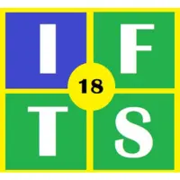

# IFTS N° 18 - Programación Sobre Redes

  

## Trabajo Práctico Teórico - Grupo A 

**Integrantes:**
- Rodriguez Farias, Lola
- Abizanda, Mariano
- Rossetti, Leandro
- Castro, Matías Ariel

## Índice de Temas

> [TP en formato PDF](https://drive.google.com/file/d/1Nst7QRyQUcy_n-UCrMpBkkl3Uo_N1lv0/view?usp=drive_link)

### Fundamentos

- ***1.*** [¿Qué es una VLAN?](./docs/01-fundamentos/q01-vlan.md)
- ***2.*** [¿Qué es una VPN?](./docs/01-fundamentos/q02-vpn.md)
- ***3.*** [¿Qué es una SAN?](./docs/01-fundamentos/q03-san.md)
- ***4.*** [Diferencias entre un Hub, Repetidor, Router y Switch](./docs/01-fundamentos/q04-dispositivos-de-red.md)

### Protocolos y Modelos

- ***5.*** [¿Qué es un protocolo de comunicaciones?](./docs/02-protocolos-y-modelos/q05-protocolo-comunicaciones.md)
- ***6.*** [TCP/IP y NetBIOS](./docs/02-protocolos-y-modelos/q06-tcpip-netbios.md)
- ***7.*** [Paquete TCP/IP y Flags](./docs/02-protocolos-y-modelos/q07-paquete-tcpip-y-flags.md)
- ***14.*** [Spanning Tree](./docs/02-protocolos-y-modelos/q14-spanning-tree.md)
- ***15.*** [OSPF](./docs/02-protocolos-y-modelos/q15-ospf.md)
- ***16.*** [ARP](./docs/02-protocolos-y-modelos/q16-arp.md)
- ***32.*** [Diferencias entre IPv4 e IPv6](./docs/02-protocolos-y-modelos/q32-ipv4-vs-ipv6.md)

### Redes

- ***8.*** [Red según geografía](./docs/03-redes/q08-red-segun-geografia.md)
- ***9.*** [Red según topología](./docs/03-redes/q09-red-segun-topologia.md)
- ***27.*** [Modelo OSI](./docs/03-redes/q27-modelo-osi.md)

### Servicios de Red

- ***10.*** [DHCP](./docs/04-servicios-de-red/q10-dhcp.md)
- ***11.*** [DNS](./docs/04-servicios-de-red/q11-dns.md)
- ***13.*** [Proxy](./docs/04-servicios-de-red/q13-proxy.md)

### Seguridad

- ***17.*** [Firewall](./docs/05-seguridad/q17-firewall.md)
- ***18.*** [DMZ](./docs/05-seguridad/q18-dmz.md)
- ***19.*** [Gateway](./docs/05-seguridad/q19-gateway.md)

### Enlaces y Conectividad

- ***20.*** [NBL Microsoft](./docs/06-enlaces-y-conectividad/q20-nbl-microsoft.md)
- ***21.*** [Tipos de enlaces](./docs/06-enlaces-y-conectividad/q21-tipos-de-enlaces.md)
- ***22.*** [LTE](./docs/06-enlaces-y-conectividad/q22-lte.md)
- ***24.*** [Calidad de enlace MPLS](./docs/06-enlaces-y-conectividad/q24-calidad-enlace-mpls.md)

### Tecnologías y Estándares

- ***12.*** [Wireless y estándares](./docs/07-tecnologias-y-estandares/q12-wireless-y-estandares.md)
- ***25.*** [Coaxial, UTP y fibra óptica](./docs/07-tecnologias-y-estandares/q25-coaxial-utp-fibra.md)
- ***28.*** [IEEE 802.3](./docs/07-tecnologias-y-estandares/q28-ieee-802-3.md)
- ***29.*** [IEEE 802.4](./docs/07-tecnologias-y-estandares/q29-ieee-802-4.md)

### Comunicaciones y Empresas

- ***23.*** [Microsoft Teams](./docs/08-comunicaciones-y-empresas/q23-microsoft-teams.md)
- ***26.*** [Certificaciones Cisco](./docs/08-comunicaciones-y-empresas/q26-certificaciones-cisco.md)
- ***30.*** [Protocolos de envío de correo](./docs/08-comunicaciones-y-empresas/q30-protocolos-envio-correo.md)
- ***31.*** [Protocolo de lectura de correo](./docs/08-comunicaciones-y-empresas/q31-protocolo-lectura-correo.md)

### Experiencia de los Integrantes

- ***33.*** [Rodriguez Farias, Lola](./docs/09-experiencia-integrantes/lola-rodriguez-farias.md)
- ***33.*** [Abizanda, Mariano](./docs/09-experiencia-integrantes/mariano-abizanda.md)
- ***33.*** [Rossetti, Leandro](./docs/09-experiencia-integrantes/leandro-russetti.md)
- ***33.*** [Castro, Matías](./docs/09-experiencia-integrantes/castro-matias.md)

