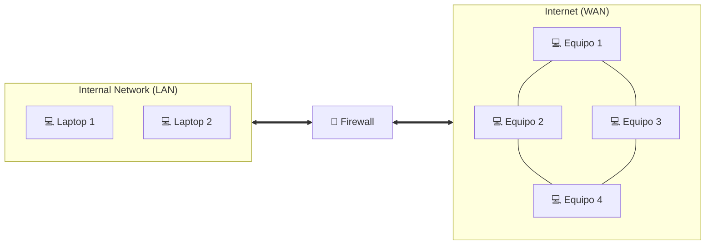

# ¿Qué es un Firewall?

Un firewall es un sistema de seguridad diseñado para monitorear, filtrar y controlar tráfico entrante y saliente en una red, ***basado en una serie de reglas definidas previamente***. Es la primera barrera o línea de defensa que encontramos entre una red de confianza y una que no, como por ejemplo, internet. Su función es prevenir que hackers, bots u otras amenazas se infiltren en una red privada y roben información sensible.

Los firewalls pueden encontrarse tanto en formato hardware (ej. los comercializados por Fortinet) como software (ej. Firewall de Windows), y funcionan inspeccionando los paquetes de datos que se transfieren entre las redes, para luego determinar si se permite su paso o si se bloquea. Las Organizaciones o personas podemos configurar estos firewalls para permitir o denegar tráfico basado en varios criterios, como por ejemplo la IP de origen o destino, los números de puerto o los tipos de protocolo.

Los firewalls también se pueden usar para filtrar contenido, como por ejemplo en el caso de  una escuela al configurarlo para impedir que los usuarios de su red accedan a material para adultos.

## Tipos de Firewall 

### Firewalls basados en proxy

Se sitúan entre los clientes y los servidores.

Los clientes se conectan al firewall, este inspecciona los paquetes salientes, y luego creará una conexión con el destinatario (servidor), y del mismo modo, cuando el servidor intenta enviar una respuesta al cliente, el firewall interceptará esa petición, inspeccionará los paquetes y a continuación entregará esa respuesta en una conexión independiente entre el firewall y el cliente.

Impide de forma efectiva la conexión directa entre el cliente y el servidor.

### Firewalls con estado

Guarda información relacionada con las conexiones abiertas y utiliza esta información para analizar el tráfico entrante y saliente, en lugar de inspeccionar cada paquete. Debido a esto, son más rápidos que los basados en proxy.

Los firewalls con estado se basan en mucho contexto a la hora de tomar decisiones. Por ejemplo, si el firewall registra paquetes salientes en una conexión que solicita un determinado tipo de respuesta, solo permitirá los paquetes entrantes en esa conexión si ofrecen el tipo de respuesta solicitado.

### Firewall de nueva generación (NGFW)

Tienen la capacidad de los firewalls tradicionales, pero además emplean funciones añadidas para hacer frente a las amenazas en otras capas del modelo OSI.

#### Algunas de estas funciones son:

- Inspección profunda de paquete (DPI) (permite aplicar reglas de filtrado más granulares).
- Conocimiento de las aplicaciones (conoce las aplicaciones que se están ejecutando y los puertos que éstas utilizan).
- Conocimiento de la identidad (qué ordenador se está utilizando, qué usuario ha iniciado sesión, etc.)
- Sandboxing (pueden aislar trozos de código asociados a los paquetes entrantes y ejecutarlos en un entorno “sandbox”).

### Firewalls de aplicaciones web (WAF)

A diferencia de los firewalls tradicionales que progeten las redes privadas de las aplicaciones web maliciosas, los WAF ayudan a proteger las aplicaciones web de los usuarios con intenciones maliciosas.

Al desplegar un WAF en una aplicación web, se coloca un escudo entre la aplicación web e internet.

### Firewall como servicio (FWaaS)

Es un modelo más reciente para ofrecer capacidades de firewall a través de la nube.

Forma una barrera virtual en torno a las plataformas, la infraestructura y las aplicaciones en la nube, al igual que los firewalls tradicionales forman una barrera alrededor de la red interna de una organización.

---

[← Volver al índice](../../README.md#índice-de-temas)
