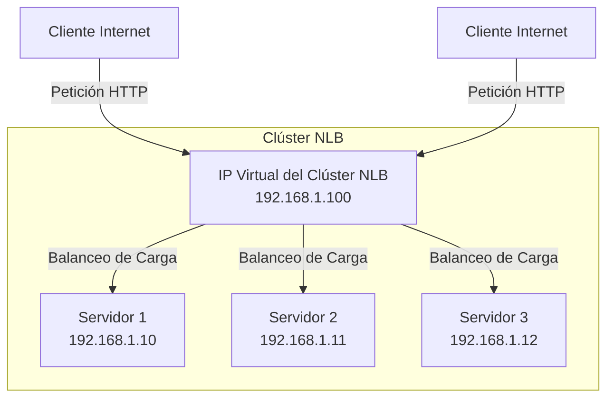

# Según Microsoft, ¿qué significa NBL?

NLB son las siglas de Network Load Balancing (Balanceo de Carga de Red). Es una tecnología clave de Windows Server, cuya función es ***permitir combinar dos o más servidores físicos o virtuales en un único clúster virtual***. 

Esto sirve para distribuir, es decir, “balancear” el tráfico entrante (como peticiones HTTP, FTP o VPN) entre los equipos del clúster. Si uno de los servidores falla, los demás absorben el tráfico automáticamente, garantizando alta disponibilidad y tolerancia a fallos.

## Beneficios clave

#### Alta disponibilidad:

Un sistema con alta disponibilidad proporciona de un modo confiable un nivel de servicio aceptable y un tiempo de inactividad mínimo.

**Características:**

- Detectar un host de clúster que experimente un error o que se desconecte y luego recuperarlo.
- Equilibrar la carga de red cuando se agregan o quitan hosts.
- Recuperar y redistribuir la carga de trabajo en diez segundos.

#### Escalabilidad:

Esto cuantifica en qué grado puede un equipo, servicio o aplicación aumentar su capacidad y cubrir una mayor demanda de rendimiento.

Brinda la capacidad de agregar gradualmente uno o varios sistemas a un clúster existente cuando la carga global del clúster supera sus posibilidades.

---

[← Volver al índice](../../README.md#índice-de-temas)
