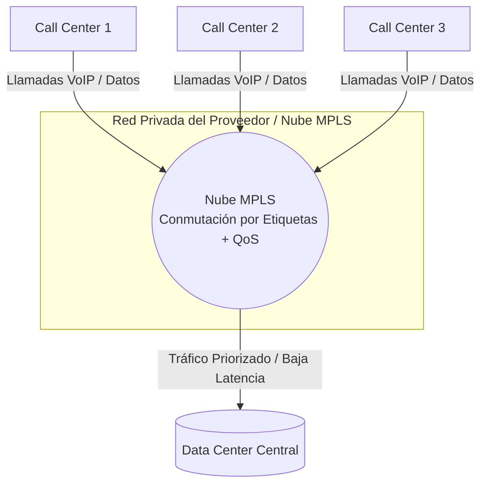
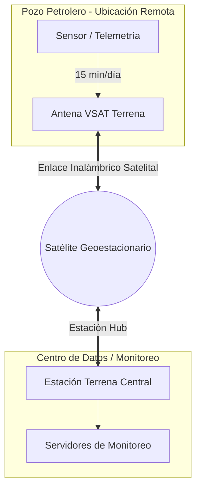
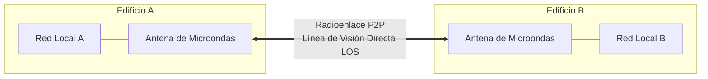

# Tipos de enlace: MPLS, LAN to LAN, microonda, VSAT

- ***a.*** Explique cada uno de estos tipos de enlace.
- ***b.*** Agregue dos tipos de enlace, no mencionados anteriormente.
- ***c.*** Ranking de enlaces según lo pedido (de uno a seis, siendo uno el mejor), por:
  - económico, 
  - performance, 
  - mayor capacidad, 
  - mayor o mejor configuración de restricciones, 
  - soporte a mayor distancia, 
  - menor esfuerzo de configuración 
- ***d.*** Elija un tipo de enlace para los siguientes escenarios:
  1. Conectividad de varios call centers con un data center central.
  2. Conectar los datos de los pozos petroleros durante 15 minutos al día.
  3. Comunicar dos edificios enfrentados en la misma calle.

## Introducción

En el contexto de las redes informáticas, un enlace se refiere a cualquier forma de comunicación entre dos puntos determinados dentro de la red. Esta conexión permite la transmisión de datos de un dispositivo a otro y es fundamental para el funcionamiento de redes de cualquier escala, desde pequeñas oficinas hasta grandes infraestructuras de internet. 

Por ejemplo, en una LAN (Local Area Network), el cable UTP que conecta nuestra computadora de trabajo al switch de la oficina es un enlace Ethernet, o la conexión inalámbrica entre nuestro celular y el Access Point de nuestra casa es un enlace Wi-Fi.

### MPLS (Multiprotocol Label Switching)

Es un protocolo de conmutación que utiliza etiquetas (labels) en lugar de direcciones IP para enrutar los paquetes de datos.

A diferencia del enrutamiento tradicional, donde cada router analiza el encabezado del paquete, MPLS permite establecer un camino predefinido (Label Switched Path o LSP) por el que viajarán los datos.

Esto se traduce en mayor velocidad en la conmutación de paquetes, mejor calidad de servicio (QoS), priorización de tráfico sensible (voz, video, etc.), separación de tráfico por cliente o aplicación, conectividad segura y eficiente entre múltiples sitios.

### LAN to LAN

Es un tipo de conexión que se establece entre 2 o más redes LAN para que se comuniquen directamente una con la/s otra/s, facilitando el intercambio de datos y el uso compartido de recursos de forma fluída.

Es una configuración de red típicamente utilizada en entornos empresariales, donde oficinas que se encuentran en distintos lugares geográficos, departamentos o centros de datos, requieren una infraestructura de red unificada para asegurar la colaboración eficiente, la administración centralizada y la transferencia segura de sus datos.

### Microondas

Consiste de tres componentes fundamentales: el transmisor, el receptor y el canal aéreo. El transmisor es el responsable de modular una señal digital a la frecuencia utilizada para transmitir, el canal aéreo representa un camino abierto entre el transmisor y el receptor, y como es de esperarse el receptor es el encargado de capturar la señal transmitida y llevarla de nuevo a la señal digital.

El factor limitante de la propagación de la señal en enlaces de microondas es la distancia que se debe cubrir entre el transmisor y el receptor, la cual además debe estar libre de obstáculos. Otro aspecto que se debe señalar es que en estos enlaces, el camino entre el receptor y el transmisor debe tener una altura mínima sobre los obstáculos en la vía, para compensar este efecto se utilizan torres para ajustar dichas alturas.

### VSAT (Very Small Aperture Terminal)

Es un sistema de comunicación por satélite que utiliza pequeñas antenas parabólicas para proporcionar transmisión de datos bidireccional a través de satélites geoestacionarios. Conecta sitios remotos a un centro central, lo que permite servicios de Internet, voz y video donde la infraestructura tradicional no está disponible. 

Conocido por su flexibilidad y rápida implementación, VSAT se utiliza ampliamente en industrias como la bancaria, marítima, de petróleo y gas, recuperación ante desastres y defensa.

## Otros enlaces no mencionados anteriormente

### Fibra Óptica Dedicada (cableada)

Tendido físico de filamentos de vidrio que transmite datos mediante pulsos de luz.

Ofrece las velocidades más altas del mercado, latencia ultra baja e inmunidad total a interferencias electromagnéticas.

Ideal para grandes volúmenes de datos.

### 4G/5G (inalámbrica)

Transmisión de datos inalámbrica basada en la infraestructura de antenas de los operadores de telefonía celular. 

Destaca por su rapidez de despliegue, movilidad y flexibilidad para contingencias o ubicaciones temporales.

## Ranking de enlaces

#### Económico

> 4G/5G → Microondas → VSAT → LAN to LAN → MPLS → Fibra Óptica

#### Performance

> Fibra Óptica → LAN to LAN → MPLS → Microondas → 4G/5G → VSAT

#### Mayor Capacidad

> Fibra Óptica → LAN to LAN → MPLS → Microondas → 4G/5G → VSAT

#### Mayor o mejor configuración de restricciones

> MPLS → LAN to LAN → Fibra Óptica → Microondas → VSAT → 4G/5G

#### Soporte a Mayor Distancia

> VSAT → 4G/5G → MPLS → LAN to LAN → Fibra Óptica → Microondas

#### Menor esfuerzo de Configuración

> 4G/5G → VSAT → Microondas → LAN to LAN → MPLS → Fibra Óptica

## Selección de enlace según escenario solicitado

### Conectividad de varios call centers con un data center central

> Enlace elegido: MPLS

Las llamadas de voz sobre IP (VoIP) requieren una latencia sumamente baja y garantizada sin pérdida de paquetes. MPLS permite etiquetar y priorizar el tráfico de voz por sobre el tráfico de datos convencional mediante políticas de QoS (Calidad de Servicio).

### Conectar los datos de los pozos petroleros durante 15 minutos por día

>Enlace elegido: VSAT

Los pozos petroleros suelen estar ubicados en áreas geográficas remotas o desérticas donde no hay infraestructura terrestre de fibra ni microondas. Al tratarse de una transmisión breve (15 minutos) de telemetría/datos, el impacto de la latencia satelital es irrelevante y VSAT garantiza cobertura global.

### Comunicar dos edificios enfrentados en la misma calle

> Enlace elegido: Microondas

Al haber línea de visión directa y una distancia muy corta, un enlace de microondas se instala en horas, no requiere romper la calle ni solicitar permisos municipales para tendido aéreo o subterráneo de cable, y ofrece un ancho de banda elevado a un costo muy reducido.

---

[← Volver al índice](../../README.md#índice-de-temas)
