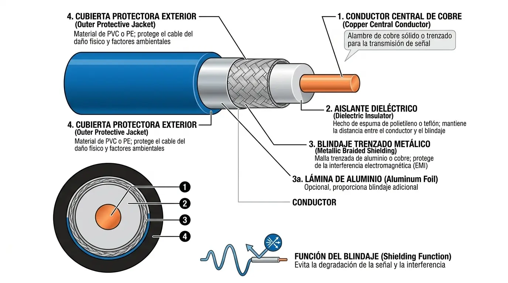
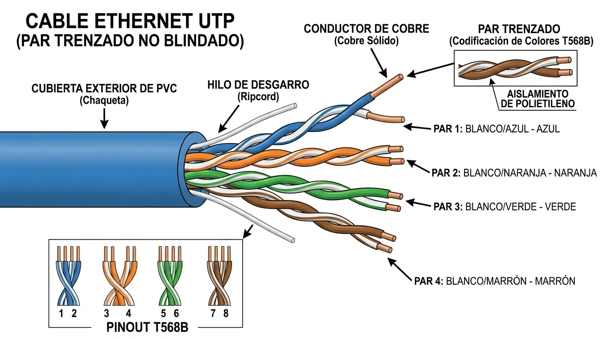
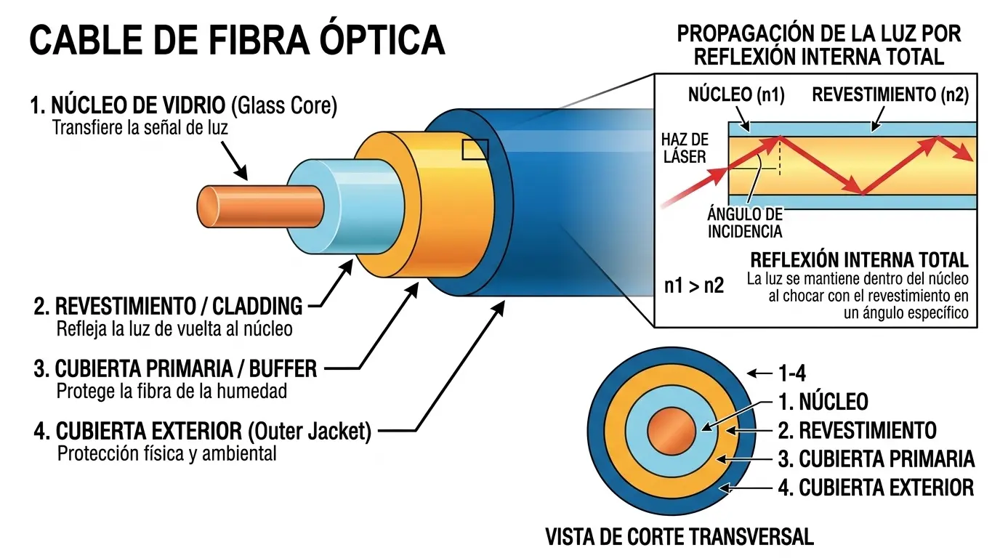

# ¿Qué diferencias puede encontrar entre una conexión Coaxial, UTP o Fibra?

## Cable Coaxial

Transmite impulsos eléctricos por un núcleo central de cobre. Históricamente se utilizó en las primeras redes informáticas en topología de bus (Ethernet 10Base2/10Base5), pero hoy quedó relegado mayoritariamente a la distribución de televisión por cable y señal de cablemódem.

### Estructura del Cable Coaxial

- **Núcleo central (Conductor de Cobre):** Vía principal por donde se transmiten las señales eléctricas de alta frecuencia.

- **Aislante dieléctrico:** Capa plástica que mantiene el núcleo centrado y evita cortocircuitos con la malla.

- **Malla / Blindaje metálico:** Malla de hilos conductores de cobre o aluminio que actúa como blindaje contra interferencias electromagnéticas (EMI).

- **Cubierta exterior:** Capa protectora de plástico o PVC que preserva la integridad del cable frente a factores externos.

## Cable UTP

Transmite impulsos eléctricos mediante pares de cobre entrelazados para reducir la diafonía (acoplamiento electromagnético entre hilos). Es el estándar absoluto para el cableado interno de redes locales (LAN), aunque tiene el límite infranqueable de 100 metros por tramo.

### Estructura del Cable UTP 

- **Pares de hilos de cobre trenzados:** Ocho hilos conductores de cobre aislados, agrupados en cuatro pares entrelazados entre sí. El trenzado cancela las interferencias electromagnéticas externas y la diafonía entre los mismos pares.

- **Código de colores de aislamiento:** Cada hilo posee una cubierta plástica con un código de colores estandarizado (Naranja/Blanco-Naranja, Verde/Blanco-Verde, Azul/Blanco-Azul, Marrón/Blanco-Marrón) para facilitar su ponchado en conectores RJ-45.

- **Hilo de rasgado (Ripcord):** Hilo sintético resistente situado a lo largo del cable bajo la cubierta, utilizado para pelar la funda exterior sin dañar los pares internos.

- **Cubierta protectora exterior:** Capa externa de PVC o polímero que agrupa los pares de cables y los protege del desgaste físico, la humedad y el polvo.

## Fibra Óptica

Convierte la información binaria en destellos de luz que rebotan dentro de un filamento de vidrio. Al no usar cobre ni corriente eléctrica, no sufre por interferencias de alta tensión ni distancias largas, siendo la tecnología más rápida y segura del mercado.

### Estructura de un cable de fibra óptica

- **Núcleo de vidrio (Core):** Filamento ultra delgado de vidrio o silicio por donde viajan los pulsos de luz (láser o LED) que transportan la información.

- **Revestimiento (Cladding):** Capa de vidrio con menor índice de refracción que rodea al núcleo, logrando que los rayos de luz reboten internamente (reflexión interna total) sin salir del canal.

- **Cubierta primaria / Buffer:** Capa plástica protectora que absorbe impactos mecánicos, humedad y previene microrroturas en el filamento de vidrio.

- **Cubierta exterior (Jacket):** Funda externa de polímero que protege la totalidad del cable contra factores ambientales y la tensión física de la instalación.

---

[← Volver al índice](../../README.md#índice-de-temas)
