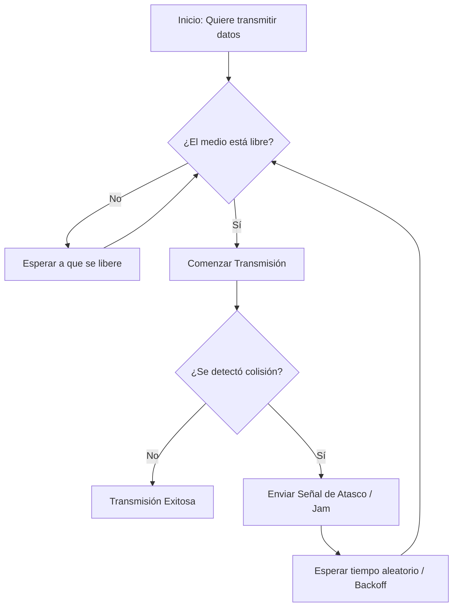

# Explicar el estándar IEEE 802.3 regula la red. Cómo se implementa, ventajas y desventajas.

El estándar IEEE 802.3, comúnmente conocido como Ethernet, define los protocolos para redes de área local (LAN) y metropolitanas (MAN), especificando la capa física y la subcapa de Control de Acceso al Medio (MAC) del modelo OSI. Utiliza el método de acceso CSMA/CD (Acceso Múltiple con Detección de Portadora y Detección de Colisiones) y es el estándar más utilizado para redes LAN cableadas.

Se implementa mediante distintos medios de transmisión, desde cable coaxial hasta par trenzado (cobre) y fibra óptica.

### Cómo Ethernet gestiona las colisiones:

## Ventajas

**Interoperabilidad:** 
- Garantiza la compatibilidad entre hardware de diferentes fabricantes (ej. tarjetas de red y switches). 

**Rendimiento y Velocidad:** 
- Ofrece alta velocidad de transmisión, estabilidad y seguridad superior frente a redes inalámbricas. 

**Flexibilidad y Costo:** 
- Utiliza tecnologías conocidas, placas de bajo costo y permite la segmentación de red mediante VLANs (IEEE 802.1Q) para mejorar la gestión y seguridad.

**Energía (PoE):** 
- Estándares como IEEE 802.3bt permiten transmitir hasta 90 W de potencia por el cable Ethernet, alimentando dispositivos IoT y reduciendo la necesidad de cableado eléctrico separado. 

## Desventajas

**Infraestructura y Costo:** 
- Requiere instalación compleja de cableado estructurado (cobre o fibra) y conectores, con costos iniciales elevados. 

**Limitaciones de Distancia y Movilidad:** 
- El cable de par trenzado tiene un límite de 100 metros sin repetidores, y los dispositivos están físicamente atados a un punto fijo. 

**Vulnerabilidad:** 
- En topologías antiguas o con fallos en el cableado principal, una avería puede colapsar la red o segmentos de ella.

**Complejidad de Configuración:** 
- Funciones avanzadas como VLANs, control de acceso y gestión de red requieren conocimientos técnicos especializados y pueden ser complejas de administrar inicialmente. 

---

[← Volver al índice](../../README.md#índice-de-temas)
