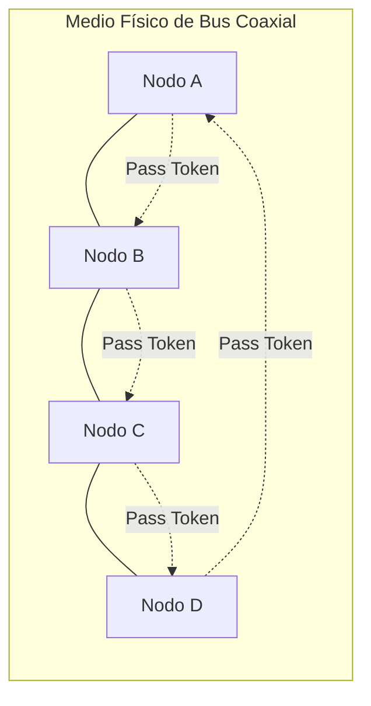

# Explicar el estándar IEEE 802.4 regula la red.

IEEE 802.4, también conocido como el estándar Token Bus, es un protocolo de red desarrollado para proporcionar un medio confiable de comunicación en redes de área local (LAN) que operan en entornos industriales y de automatización. General Motors lo utilizó en su Protocolo de fabricación automatizada (Manufacturing Automation Protocol, MAP). 

A diferencia de otros protocolos, este estándar se centra en la transmisión de datos de manera ***determinista y predecible***, lo que lo hace especialmente adecuado para aplicaciones que requieren tiempos de respuesta consistentes y controlados. 

### Ventajas

A diferencia de una oficina o navegación web, que un paquete de datos tarde 5 milisegundos o 500 milisegundos por congestión no afecta críticamente la experiencia. Sin embargo, en la automatización industrial ofrece algunas ***ventajas clave***:

- **Control en tiempo real:** Si un sensor detecta sobrepresión en una caldera o un robot debe detenerse al llegar a una posición, la orden de parada debe llegar dentro de una ventana de tiempo estricta (ej. en menos de 10 ms).

- **Seguridad operativa:** Un retraso impreviso causado por colisiones de red podría provocar una falla mecánica o un accidente grave. El determinismo asegura que el canal de comunicación sea 100% confiable y predecible bajo cualquier nivel de tráfico.

### Desventajas

Entre las desventajas podemos mencionar:

- **Complejidad:** El protocolo es más complejo de implementar en comparación con métodos de acceso como CSMA/CD.

- **Fallo del token:** Si el token se pierde o un dispositivo falla, la red puede experimentar interrupciones hasta que se recupere.

## Estructura

- Está físicamente construída como un bus, semejante a la red IEEE 802.3, aunque desde el punto de vista lógica la red se organiza como si se tratase de un anillo.
- Cada nodo tiene un número asociado por el que es identificado unívocamente.
- El testigo (token) es generado por el nodo con el número mayor cuando se pone en marcha la red.
- El testigo se pasa al nodo siguiente en orden descendente de numeración.
- Este nuevo nodo recoge el testigo y se reserva el derecho de ***emisión***. 
- Cuando ha transmitido cuanto necesitaba, o si ha expirado un tiempo determinado, debe generar otro testigo con la dirección del nodo inmediatamente inferior.
- El proceso se repite para cada nodo de la red. De este modo, todos los nodos pueden transmitir periódicamente.

En la capa física, la red IEEE 802.4 utiliza un cable coaxial de 75 ohmios, lo que ofreció ventajas decisivas para la industria:

- A diferencia del cable UTP convencional de oficina, el cable coaxial cuenta con una malla metálica exterior que progete la señal de la interferencia electromagnética generada por motores eléctricos, soldadoras o maquinaria pesada en fábricas.
- Permite modular múltiples señales a distintas frecuencias simultáneamente sobre el mismo cable físico. Esto posibilitaba transmitir voz, video de monitoreo y datos de control industrial sobre un único tendido.
- El cable coaxial permitía derivaciones mediante conectores en T o derivadores (taps) pasivos a lo largo de grandes distancias en plantas industriales sin perder calidad de señal.

## Estado actual

Este estándar ha sido abandonado y considerado obsoleto, reemplazado en la práctica por Ethernet (IEEE 802.3) debido a su complejidad y costo de implementación.

---

[← Volver al índice](../../README.md#índice-de-temas)
